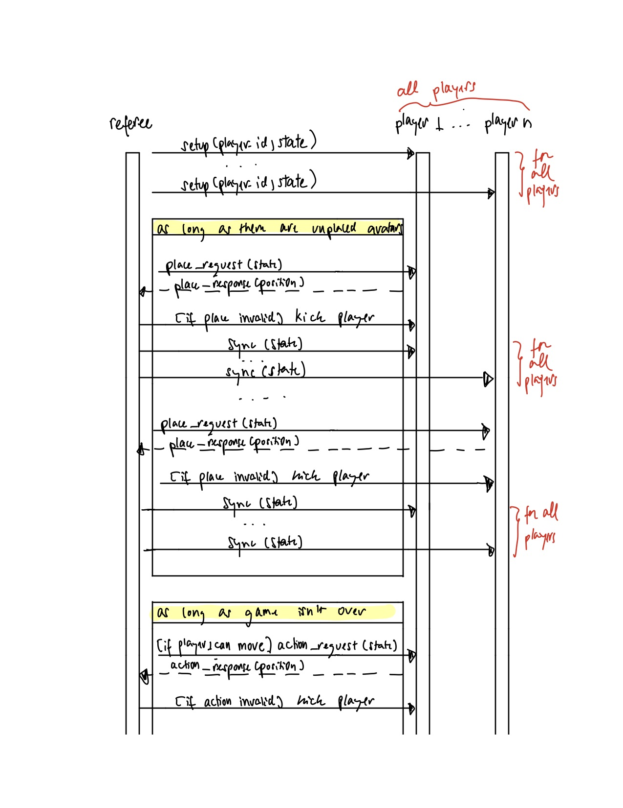
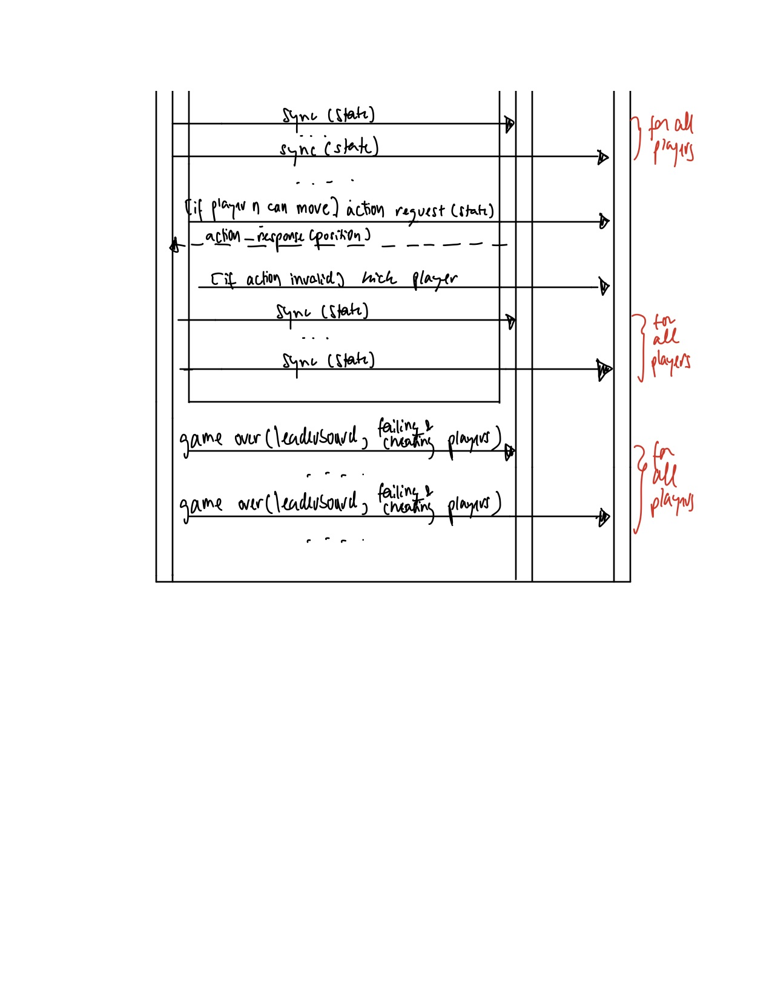

# Protocol for Player API

The protocol for the Player API can be described by the following diagram:  

Below, we will describe each step of the diagram in detail.

## Setup Phase  
Before gameplay can begin, the referee will invoke `setup` for each player. This will provide each player with their player id and the starting game state on which there are no no penguins placed.

## Placement Phase
The referee will repeatedly invoke `place_request` for one player at a time in the correct player order (i.e. sorted in ascending order by age) until all penguins are placed on the board.

Upon receiving a `place_request`, a player is expected to respond to the referee via a `place_response` with a valid `Position` that describes where they would like to place their avatar. If valid, their penguin will be placed at the provided position.

In the event that a player attempts to cheat or does not send a valid position according to the rules of Fish, they will be removed from the game, and the referee will send that player a `kick_player` to let them know they have been removed. If the player successfully placed any penguins prior to the infraction, their penguins will be removed, but the tiles that those penguins were on will remain in the game.

After any penguin is placed or a player is removed from the game, all players will be sent the current game state via a `sync` to ensure consistency.

## Movement Phase
After all initial placements are made, the referee will repeatedly invoke `move_request` for one player at a time in the correct player order until there are no more moves that any of the players can make. If a player cannot make a move, they will not receive a `move_request` from the referee.

Upon receiving a `move_request`, a player is expected to respond to the referee via a `move_response` with a valid `Action` that describes the position of the penguin they would like to move and the position they would like to move it to. If valid, this will carry out the action.

In the event that a player attempts to cheat or does not send a valid action according to the rules of Fish, they will be removed from the game, and the referee will send the player a `kick_player` to let them know they have been removed. All of that player's penguins will be removed, but the tiles that those penguins were on will remain in the game.

After any penguin is moved or a player is removed from the game, all players will be sent the current game state via a `sync` to ensure consistency.

## Game End Phase  
Once no more players can make a move, the game ends. The referee will send a final message to all players via `game_over`. This call will contain the leaderboard for the game that indicates each player's score (i.e. a dict with keys of player ids and values of scores as integers), a list of the player id's of players who were removed due to cheating, and a list of the player id's of players who were removed due to providing invalid moves.
