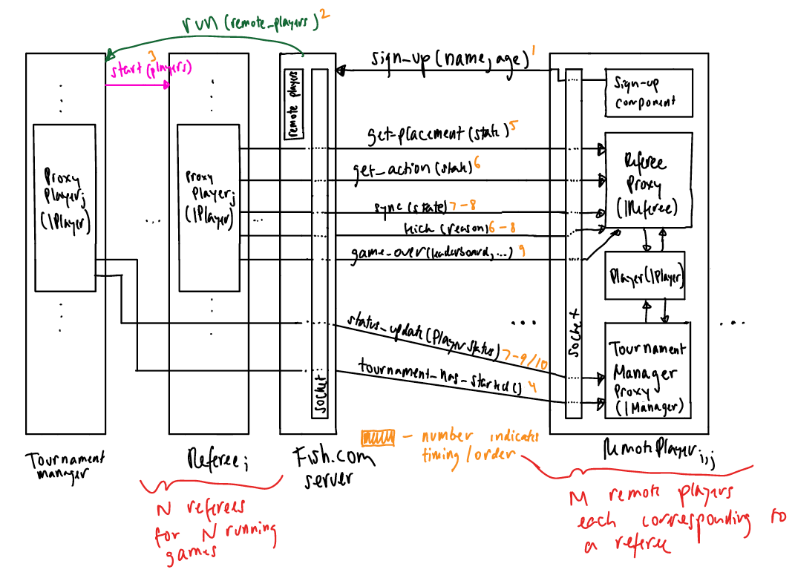

## Remote Collaboration Protocol

### Diagram

The protocol for the remote collaboration API can be described via the following diagram:

**Note: to see our diagram in more detail, please zoom in or click on the image.*

Below, we will explain the protocol with english prose.

### Explanation

The protocol for the remote collaboration API can be broken down into two distinct sections:

1. Administrative
2. Player

Additionally, the message format specification can be found below.

#### Administrative

the administrative section of the API represents all components on the Fish.com server. The server first has a sign-up
period in which it collects remote players to play in a tournament. The server waits for a specified number of players
to sign up and then runs the tournament with the specified remote players via the tournament manager component.

The tournament manager component of the server is responsible for running a tournament to completion. It first receives
the remote players who wish to play in the tournament. It then starts the tournament by allocating the remote players
to referee's. The tournament component additionally sends a notification to the remote players when the tournament
starts and sends status updates to players while the tournament is in progress.

The referee component of the server is responsible for running individual games within the tournament. It first receives
2-4 players from the tournament manager component. The referee then prompts players to make penguin placements during
the placement phase and move actions after the placement phase via the proxy player. Upon receiving the penguin
placements and move actions from players, the referee sends a response to remote players via the proxy player in regards
to whether the action was successful. Additionally, the referee will provide the remote player with a sync'd gamestate,
a notification regarding if the player is kicked from their game, and a notification of when a player's game is over.

#### Player

The player section of the API represents the remote players participating in a tournament. Remote players sign up for
tournaments via a sign-up component. The remote players can sign up for a tournament by providing their age and name via
a socket to the Fish.com server. The remote player will receive either a success or failure message indicating whether
their sign-up was successful. 

Upon the tournament starting, the remote player will be assigned to a referee in order to play a complete game. The
remote player interacts with the referee via a referee proxy. The referee proxy will prompt the remote player to provide
penguin placements and move actions, then receiving a response regarding the validity of the action. Additionally, the 
referee proxy will provide the remote player with a sync'd gamestate, a notification regarding if the player is kicked
from their game, and a notification of when a player's game is over.

The remote player also has a tournament manager proxy to interact with the Fish.com server's tournament manager. The
tournament manager proxy receives a notification when the tournament has started and for all status updates relevant
to the player. This includes if the player won or lost a game and if the player won the tournament.
    
#### Message Formats

Messages between the administrative and player sides will be in JSON format.
