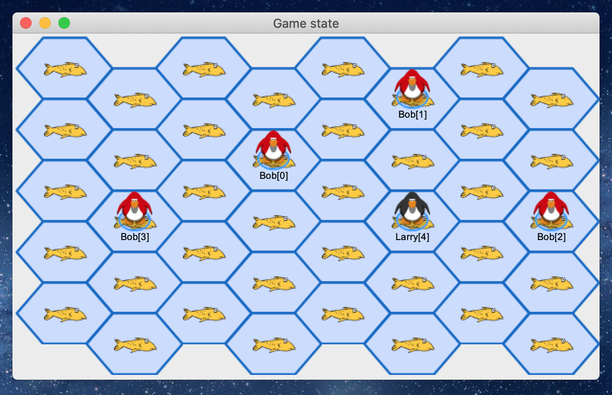

# Fish

> This project is a system that allows players to submit their own AI players to tournaments. These tournaments consist of multiple games of Fish. Fish is a game where players attempt to eat the most fish on a board containing tiles that have a certain number of fish.

## Project structure

- **Common/**: contains all source code and visual assets that accompany the source code
  - **ext/**: contains helpers for testing
  - **sprites/**: contains visual assets (i.e. sprites for tiles, player pieces, and fish)
  - **tests/**: contains tests for source code
- **Planning/**: contains documentation detailing system design and project planning

## Usage
- General usage: 
	- To be implemented in a future assignment

- Before you run anything, run `make`
- To run tests:
    - Unit tests:
        - run `./xtest`: doing so will run non-visual unit tests
    - GUI tests
        - navigate to **Common/tests**
        - run `./render_tile_test.py`: for a visual rendering of our board
        - run `./render_state_test.py`: for a visual rendering of a game state
    - Note: you should only test these in a graphical environment - otherwise, results may not be as expected

- To alter program logic:
	- Each file name should be descriptive enough as to describe what component of the game/system it represents. To alter any of the components of our game/system, navigate to the files in **Common/** that are not contained in the **sprites** or **tests** directories.

## Current Board State
Here is what our board currently looks like: 

